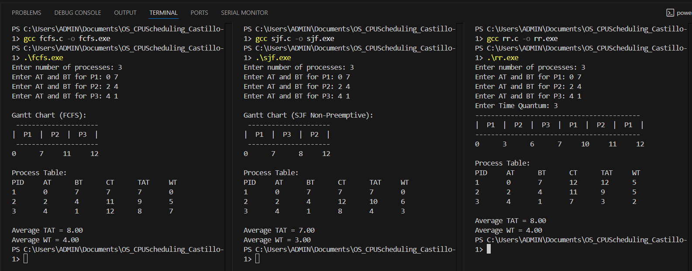

# CPU Scheduling Algorithms in C

### 1. First-Come, First-Served (FCFS)

**What it does:**  
FCFS runs processes in the exact order they arrive—just like people lining up at a checkout. Each process finishes before the next one starts.

- **Good for:** Simple use cases where the order doesn’t matter.
- **Not so good for:** Situations where a long job can make later (even quick) jobs wait a long time.

**Key Formulas:**
- Completion Time (\(CT\)) = When the process finishes
- Turnaround Time (\(TAT\)) = \(CT - AT\) (AT: Arrival Time)
- Waiting Time (\(WT\)) = \(TAT - BT\) (BT: Burst Time/Execution Time)

---

### 2. Shortest Job First (SJF, Non-Preemptive)

**What it does:**  
SJF always looks for the next process with the shortest burst time (how long it takes to run). It picks the smallest job from all that have arrived and runs it to the end before looking for the next shortest.

- **Good for:** Lowering the total wait time when short jobs are common.
- **Not so good for:** Long jobs—they might wait a long time if short jobs keep arriving.

**Key Formulas:**
- Use the same formulas as FCFS but always pick the shortest ready job next.

---

### 3. Round Robin (RR)

**What it does:**  
RR gives every process a fair “time slice” (quantum). Each process runs for a set time, then if it’s not done, it goes to the back of the queue to wait for another turn. This keeps the system fair and responsive.

- **Good for:** Multi-user systems where everyone gets a fair share.
- **Not so good for:** Jobs that could finish if they just had a little more uninterrupted time.

**Key Formulas:**
- Remaining Time (\(RT\)): If \(RT > TQ\) (TQ: Time Quantum), run for TQ, else finish the job.
- Update Completion, Turnaround, and Waiting Time each time a process finishes.

---

## Sample Input/Output & Screenshots

---

## References

- Classic scheduling algorithms from operating systems courses and textbooks.
- Actual screenshots and outputs generated from C implementations in this repository.

